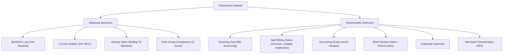

# Unified Fraud Intelligence Engine Architecture

Brim's **Unified Fraud Intelligence Engine** (`backend/fraud/engine.py`) is a self-contained, highly explainable component designed to detect expense anomalies, policy evasion techniques, and potential fraud patterns. It combines deterministic pattern recognition, forensic accounting statistics, and a composite employee risk profiling system.

---

## 1. Core Data Models

The engine utilizes two primary data models defined as dataclasses:

### `FraudFlag`
Represents an identified anomaly/fraud pattern in the transaction dataset.
- **`pattern_type`**: The type of anomaly (e.g., `SMURFING`, `BENFORDS_VIOLATION`, etc.).
- **`transaction_ids`**: The exact list of transactions involved in this specific alert.
- **`employee_names`**: The employees associated with these transactions.
- **`severity`**: Danger level of the pattern (`CRITICAL`, `HIGH`, `MEDIUM`, `LOW`).
- **`total_amount_cad`**: Combined exposure value converted to Canadian Dollars (CAD).
- **`description`**: A human-friendly explanation of the deterministic trigger.
- **`extra`**: A dictionary containing underlying statistical metrics (e.g., Z-scores, p-values, observed frequencies).

### `EmployeeRiskProfile`
An aggregated profile constructed per employee to reflect their overall risk posture.
- **`composite_score`**: An integer score between `0` and `100` computed via a weighted average of active fraud signals.
- **`risk_tier`**: Categorical label derived from the composite score:
  - `CRITICAL` (score $\ge 80$)
  - `HIGH` (score $\ge 60$)
  - `MEDIUM` (score $\ge 35$)
  - `LOW` (score $< 35$)
- **`signal_breakdown`**: Individual sub-scores and descriptive details for each active signal.
- **`top_signals`**: The top 3 most severe risk indicators for the employee.

---

## 2. Anomaly and Fraud Pattern Detectors

The engine evaluates 10 specialized detectors. Each detector has a unique "kill zone" mapping to specific compliance and financial risk vectors.

### 1. Smurfing (`detect_smurfing`)
* **Objective**: Catches threshold-structuring behavior where an employee executes multiple small charges to bypass pre-authorization limits (default is $50 USD).
* **Logic**:
  1. Filters transactions below the pre-authorization limit.
  2. Sorts chronological transactions for each employee.
  3. Uses a rolling time-window (default: 72 hours).
  4. Triggers if the cumulative sum exceeds a material threshold (default: $500 CAD) and involves $\ge 4$ distinct transactions.
* **Example**: An employee makes 8 separate purchases of $49.50 over a single weekend to bypass the $50 manager pre-authorization limit, totaling $396.

### 2. Split Billing (`detect_split_billing`)
* **Objective**: Identifies situations where two different employees split a single high-value bill into separate company cards to avoid limit constraints.
* **Logic**:
  1. Groups transactions by merchant.
  2. Compares pairs of transactions occurring within a rolling window (default: 30 minutes).
  3. Verifies that the employees are different.
  4. Checks that transaction amounts are near-identical (within ±$2.50 USD tolerance) and above a material floor (default: $40.00 USD).
* **Example**: Frank and Eric both charge $78 to "Roadside Grill" 28 minutes apart because the actual single bill was $156, and their individual meal limit is $100.

### 3. Structuring (`detect_structuring`)
* **Objective**: Detects merchant payments deliberately partitioned to evade granular approval flows.
* **Logic**:
  1. Filters transactions that are exact round numbers (e.g., $200, $400, $500, with a ±$1 tolerance).
  2. Groups by merchant.
  3. Triggers a high-severity flag if any single merchant receives $\ge 5$ round-number transactions during the period.
* **Example**: An employee submits 12 different charges for exactly $200, $400, or $500 to a consulting firm, indicating fabricated or artificially split payments.

### 4. Z-Score Outliers (`detect_zscore_outliers`)
* **Objective**: Statistically highlights anomalous transaction amounts within specific merchant categories.
* **Logic**:
  1. Groups transactions by Merchant Category Code (MCC).
  2. Computes the mean ($\mu$) and standard deviation ($\sigma$) of the transaction amounts (in CAD) for groups with $\ge 5$ records.
  3. Calculates the Z-score for each transaction amount $x$:
     $$Z = \frac{x - \mu}{\sigma}$$
  4. Flags transactions exceeding a threshold (default: $Z > 5.0$) with a material floor of $300 CAD.
* **Example**: The average cost for MCC 5812 (Restaurants) is $65. An employee submits a single $4,500 restaurant charge, creating an extreme Z-score outlier.

### 5. Shell Vendors (`detect_shell_vendors`)
* **Objective**: Catches potential employee-owned or fictitious shell companies injected into the vendor stream.
* **Logic**:
  1. Targets new vendors (first transaction within the last 45 days).
  2. Evaluates the ratio of round-number charges ($100, $200, $400, $500).
  3. Triggers if a new vendor has $\ge 3$ transactions and $\ge 80\%$ of them are round numbers.
* **Example**: A brand-new merchant called "Premium Fleet Services" appears this month, and 100% of its charges are for exactly $200 and $400.

### 6. Benford's Law (`detect_benfords_law`)
* **Objective**: Applies standard forensic accounting tests to discover fabricated or manipulated expense claims.
* **Logic**:
  1. Extracts the first significant digit (1 through 9) from transaction amounts (in USD).
  2. Aggregates digit frequencies per employee (requires a minimum of 30 transactions).
  3. Performs a Chi-squared goodness-of-fit test against the theoretical Benford distribution:
     $$P(d) = \log_{10}\left(1 + \frac{1}{d}\right)$$
  4. Computes the Chi-squared test statistic ($\chi^2$) and p-value.
  5. Flags the employee if $p < 0.01$ (statistically significant deviation), highlighting the most deviant digit.
* **Example**: In a natural dataset, expenses starting with '1' should occur ~30% of the time, and '9' ~4% of the time. If an employee submits 50 expenses and 40% of them start with '9' (e.g. $99, $95, $900), the test flags the unnatural human fabrication.

### 7. Velocity Spike (`detect_velocity_anomalies`)
* **Objective**: Flags abnormal surges in transaction frequency and volume.
* **Logic**:
  1. Calculates daily spending totals (CAD) for each employee.
  2. Determines weekly rolling expenditures.
  3. Establishes a historical personal baseline (excluding the final week).
  4. Computes the mean and standard deviation of historical weekly spends.
  5. Flags a velocity spike if the most recent weekly spend exceeds the baseline by $Z > 3.0$ and is above $500 CAD.
* **Example**: An employee who typically spends $150 a week on supplies suddenly spends $3,500 in a single week, severely breaking their normal velocity.

### 8. Duplicate Expenses (`detect_duplicate_expenses`)
* **Objective**: Identifies double-billing or copy-pasted receipt submissions by the same employee.
* **Logic**:
  1. Identifies transactions by the same employee at the same merchant.
  2. Compares amounts within a rolling window (default: 7 days) above a material floor ($40 USD).
  3. Flags identical amounts (with a 0\% variance tolerance) as highly suspicious duplicate submissions.
* **Example**: A user submits a $142.50 expense to "Delta Airlines" on Monday, and then submits another $142.50 expense to "Delta Airlines" on Wednesday, reusing the same receipt.

### 9. Peer Anomalies (`detect_peer_anomalies`)
* **Objective**: Detects employees whose aggregate spend is a statistical outlier compared to colleagues in the same business unit.
* **Logic**:
  1. Excludes capital purchases exceeding $10,000 USD to prevent skewing the baseline.
  2. Summarizes total expenditure (CAD) per employee within their department.
  3. Calculates the department mean and standard deviation (requires $\ge 3$ department members).
  4. Flags employees whose personal total spend exhibits a high Z-score ($Z > 0.8$) relative to department peers.
* **Example**: The Engineering department averages $1,200 in monthly expenses per person, but one specific engineer claims $8,500 for the month, standing out strongly from their peers.

### 10. Merchant Concentration (`detect_merchant_concentration`)
* **Objective**: Pinpoints vendor favoritism, potential kickback schemes, or card abuse at a single vendor.
* **Logic**:
  1. Evaluates employees with $\ge 10$ transactions across $\ge 3$ distinct merchants.
  2. Calculates the Herfindahl-Hirschman Index (HHI) for the employee's vendor allocation:
     $$HHI = \sum_{i=1}^{N} s_i^2$$
     where $s_i$ is the share of the employee's total CAD spend directed to merchant $i$.
  3. Flags an anomaly if $HHI > 0.4$ (extreme concentration), meaning a massive portion of total spend goes to a single supplier.
* **Example**: An employee makes purchases from 15 different merchants, but funnels 85% of their total $25,000 budget to a single unapproved catering vendor, indicating a potential kickback scheme.

---

## 3. Composite Risk Profiling Engine

The composite risk engine translates multi-dimensional detector alerts into a unified credit/risk grade per employee.

### Signal Allocation and Weights
The risk profiling engine considers 6 standard risk indicators. Each active indicator is assigned a target weight:

| Risk Signal | Target Weight | Description |
| :--- | :--- | :--- |
| **`cluster_involvement`** | `0.30` (30%) | Flagged in transactional fraud clusters (e.g. smurfing, split billing, structuring) |
| **`benfords_deviation`** | `0.20` (20%) | Failure of forensic digit distribution test |
| **`velocity_spike`** | `0.15` (15%) | Significant spending spike above personal historical baseline |
| **`policy_violation_rate`** | `0.15` (15%) | Percentage of total transactions violating deterministic policies |
| **`peer_deviation`** | `0.10` (10%) | Spending significantly exceeding department peers |
| **`merchant_concentration`** | `0.10` (10%) | Unusually high concentration of spend at one merchant (HHI) |

### Score Compilation Formula
To prevent score dilution, the engine only aggregates signals that are actively triggered:
$$\text{Composite Score} = \text{round}\left( \frac{\sum_{i \in \text{active}} \text{Sub-score}_i \times \text{Weight}_i}{\sum_{i \in \text{active}} \text{Weight}_i} \right)$$
*If no signals are active, the composite score defaults to `0`.*

### Sub-score Derivation Logic
1. **Cluster Involvement**: Set to the severity score of the worst involved cluster (CRITICAL: 90, HIGH: 70, MEDIUM: 45). Boosted by $+10$ or $+20$ points if involved in multiple distinct fraud clusters.
2. **Benford Deviation**: Derived from the Chi-squared p-value ($p < 0.001 \rightarrow 100$, $p < 0.01 \rightarrow 70$, $p < 0.05 \rightarrow 40$).
3. **Velocity Spike**: Mapped from the personal velocity Z-score ($Z > 5 \rightarrow 100$, $Z > 3 \rightarrow 70$, $Z > 2 \rightarrow 40$).
4. **Policy Violation Rate**: Derived from the proportion of policy-violating transactions ($r > 20\% \rightarrow 100$, $r > 10\% \rightarrow 70$, $r > 5\% \rightarrow 40$).
5. **Peer Deviation**: Derived from department spend Z-score ($Z > 3.0 \rightarrow 100$, $Z > 1.5 \rightarrow 70$, $Z > 0.8 \rightarrow 40$).
6. **Merchant Concentration**: Derived from HHI score ($HHI > 0.7 \rightarrow 100$, $HHI > 0.5 \rightarrow 70$, $HHI > 0.4 \rightarrow 40$).
