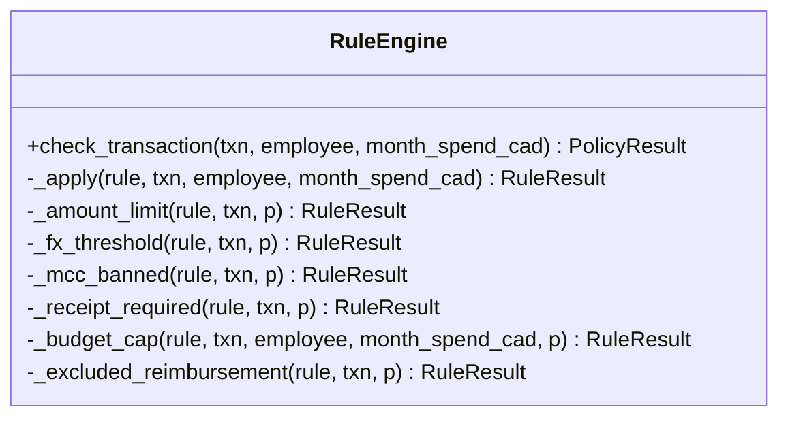

# Policy Exceptions and Rules Engine Architecture

Brim's **Policy Exceptions and Rules Engine** operates as the Tier-1 compliance gate. It is designed to evaluate 100% of corporate card transactions deterministically, flag non-compliant spending without expensive AI dependencies, and organize findings into action-oriented cases for finance managers.

---

## 1. The Tier-1 Deterministic Rule Engine

The core evaluation logic resides in `backend/policy/rule_engine.py` under the `RuleEngine` class. 

- **Static Validation**: It runs with zero LLM dependency, ensuring instant, cost-free, and repeatable decisions.
- **FX-Evasion Protection**: Every monetary check evaluates against `amount_cad`. This ensures FX-evasion techniques (such as a $499 USD transaction bypassing a $500 domestic limit by exploiting exchange rates, i.e., ~$688 CAD) are captured.
- **Severity Flagging**:
  - Direct violations containing high-severity infractions are categorized as **`VIOLATION`**.
  - Medium or Low-severity infractions are flagged as **`REVIEW`** rather than a hard block, alerting managers without halting workflows.
  - Transactions that pass all rules are marked **`COMPLIANT`**.

---

## 2. Supported Rule Types & Evaluation Logic



### `AMOUNT_LIMIT`
Enforces a maximum threshold on single transactions.
- **Logic**: Evaluates `txn.amount_cad` against an exchange-rate-adjusted limit:
  $$\text{limit\_cad} = \text{max\_amount\_cad} \lor (\text{max\_amount\_usd} \times \text{txn.conversion\_rate})$$
- **Exceptions**: If the rule parameters specify `requires_pre_authorization=True`, the transaction will bypass this violation **only if** `txn.is_pre_authorized` is true.

### `FX_THRESHOLD`
Specifically target high-value international spending.
- **Logic**: Evaluates whether foreign currency transactions exceed a CAD equivalent floor (default: $68.95 CAD).
- **Exceptions**: Overridden if the transaction has been pre-authorized.

### `MCC_BANNED`
Blocks card usage at unauthorized categories.
- **Logic**: Suppresses transactions matching prohibited Merchant Category Codes (MCC).
- **Fuzzy Matching**: In addition to exact MCC code matching, it runs keyword token-matching on merchant names, descriptions, or transaction details (e.g., matching keywords like "casino" or "massage").

### `RECEIPT_REQUIRED`
Mandates physical receipt verification for material expenses.
- **Logic**: Checks if `txn.amount_usd` is greater than a specified threshold (e.g., $50.00 USD). If true, it verifies that `txn.receipt_url` is populated.

### `BUDGET_CAP`
Enforces individual or departmental monthly limits.
- **Logic**: Uses a pre-computed month-to-date spending projection:
  $$\text{Projected Spend} = \text{MTD Spend (prior to transaction)} + \text{txn.amount\_cad}$$
- **Evaluation**: Triggers a violation if the projected spend exceeds the employee's personal monthly limit or a department-level cap.

### `EXCLUDED_REIMBURSEMENT`
Blocks individual items or specific terms (e.g., "gift card", "alcohol").
- **Logic**: Normalizes and matches target tokens against the merchant name and category descriptions.

---

## 3. Compliance Case Aggregation and Bucketing

Rather than overwhelming managers with a raw stream of isolated alerts, the sync layer in `backend/compliance/cases.py` aggregates and groups related findings.

### Case Fingerprinting
To prevent state loss when transactions are re-scanned, the system generates a stable `fingerprint` hash. This fingerprint acts as a natural primary key, allowing cases to survive database refreshes and preserve notes, status, and manual updates.
- **Cluster Fingerprint**: `cluster:{pattern_type}:{comma_delimited_txn_ids}`
- **Policy Exception Fingerprint**: `policy:{employee_id}:{year_month_string}:{policy_bucket}:{severity}`

### The Merging Protocol (`MIXED` Cases)
If an anomaly detector (Tier-2) and a deterministic policy check (Tier-1) fire on the same underlying transaction, the system merges them:
1. The case type is marked as **`MIXED`**.
2. Both policy and statistical evidence are presented within the same dashboard card.
3. This prevents duplicate review workflows for the same transaction.

### Automated Case Bucketing
When grouping policy exceptions, the system maps transaction reasons to discrete, manager-friendly categories:

| Target Reason Phrase | Policy Case Bucket | Recommended Action |
| :--- | :--- | :--- |
| `"missing receipt"` | **`Missing receipts`** | Request supporting information |
| `"pre-auth"`, `"threshold"`, `"fx-adjusted"` | **`Authorization threshold`** | Review before approval |
| `"budget"` | **`Budget overrun`** | Review before approval |
| `"prohibited"`, `"banned"` | **`Prohibited category`** | Review before approval |
| *Else* | **`Policy exception`** | Review before approval |

### Auto-Resolution Protocol
If a subsequent data ingest or scan resolves the underlying policy exception or anomaly (e.g., the employee uploads a missing receipt, or a transaction is adjusted), the system automatically updates the case:
- Case status is changed to `RESOLVED`.
- An event history log is appended: `"Case was not detected in the latest analysis run."` with the actor marked as `System`.

---

## 4. Approval and Override Workflow

Transactions require sign-off when flagged with policy issues or pending status. The workflow in `backend/routers/approvals.py` exposes one-click decision endpoints:

```
[Pending Transaction / Policy Flag]
       │
       ├─► [APPROVE] ──► sets transaction.is_pre_authorized = True
       │                 sets transaction.approval_status = "APPROVED"
       │
       ├─► [DENY]    ──► sets transaction.approval_status = "REJECTED"
       │
       └─► [INFO]    ──► sets transaction.approval_status = "INFO_REQUESTED"
```

- **Pre-authorization Override**: Clicking `APPROVE` automatically updates the transaction's `is_pre_authorized` flag to `True`. During subsequent runs of the Tier-1 rules engine, this pre-authorization suppresses any future `AMOUNT_LIMIT` or `FX_THRESHOLD` flags for that transaction, effectively recording a formal management exception.
- **Case Audit Events**: Any actions taken by managers (e.g., `MARK_REVIEWED`, `ESCALATE`, `REQUEST_INFO`, `DISMISS_FALSE_POSITIVE`) create immutable audit events (`ComplianceCaseEvent`) with details on who took the action and when, ensuring a pristine audit trail.
